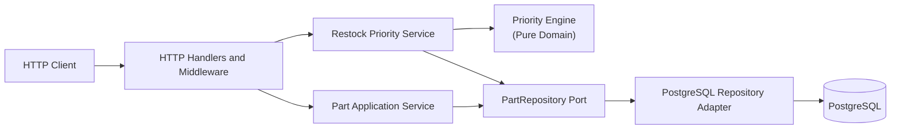
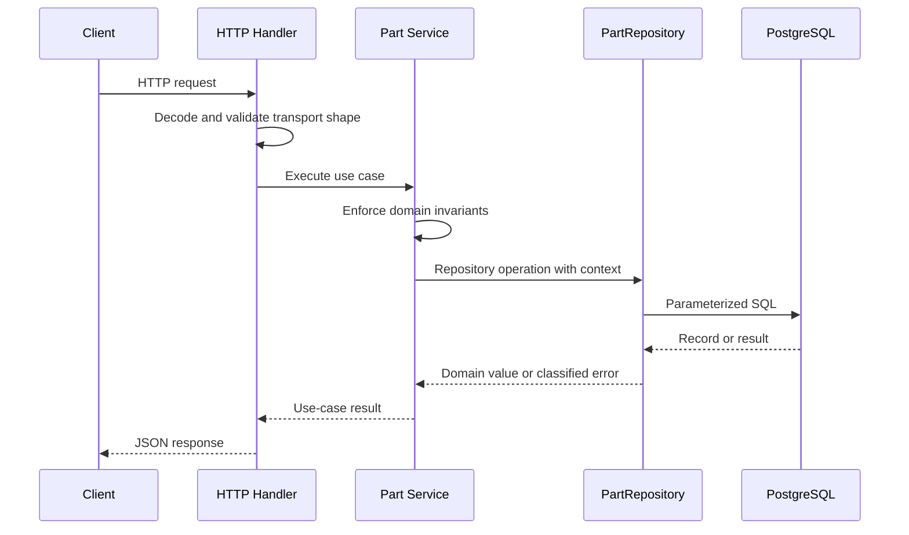

# System Design

## Purpose

This document is the source of truth for the architecture of the Restock Priority
Service. Product behavior remains defined by the
[core service specification](../sdd/specs/001-core-service.md).

The design favors explicit dependencies, a pure domain model, and operational
simplicity. It provides clear seams for testing and future persistence changes
without introducing infrastructure that the current scale does not require.

## Technology baseline

- Go 1.26 is the implementation language and supported toolchain.
- `github.com/gin-gonic/gin` provides HTTP routing and middleware.
- `gorm.io/gorm` and `gorm.io/driver/postgres` provide PostgreSQL connectivity and ORM persistence.
- `github.com/shopspring/decimal` provides exact decimal values and calculations.
- `github.com/joho/godotenv` loads local `.env` environment configuration.
- `github.com/stretchr/testify` provides assertions for tests.
- `log/slog` provides structured logging.

Dependency versions are pinned by `go.mod` and `go.sum`. A new framework or
substitute for one of these choices requires an approved specification change and,
when the consequences are durable or cross-cutting, an ADR.

## Component view



## Dependency direction

Dependencies point inward:

```text
transport and persistence adapters → application → domain
```

- The **domain** contains `Part`, domain validation, priority calculations, and
  ordering rules. It imports neither HTTP nor database packages.
- The **application layer** coordinates use cases and owns the `PartRepository`
  interface it consumes.
- The **HTTP adapter** translates requests and responses. It does not calculate
  priorities or make persistence decisions.
- The **PostgreSQL adapter** implements the application-owned repository port. It
  does not contain business ranking rules.
- The composition root creates concrete dependencies and is the only place that
  knows the complete object graph.

Transport DTOs, domain types, and database records are separate types. Conversion
at boundaries prevents database or JSON concerns from leaking into the domain.

## Suggested package boundaries

```text
api                       OpenAPI description of the contract, embedded into the binary
cmd/api                   application entry point and composition root
cmd/migrate               migration runner, applied before the API serves traffic
internal/domain           entities, value objects, validation, priority engine
internal/application      use cases and repository ports
internal/adapter/http     routing, middleware, DTOs, error mapping
internal/adapter/postgres PostgreSQL repository implementation
internal/adapter/memory   in-process repository implementation, used by tests
internal/platform         configuration and narrowly scoped runtime helpers
migrations                versioned SQL migrations, embedded into cmd/migrate
```

The final package tree may use fewer packages when a boundary has too little
behavior to justify a separate package. Package names must describe a cohesive
responsibility rather than a technical dumping ground.

## CRUD flow



The application service maps expected persistence outcomes, such as a missing
part, to application errors. The HTTP adapter maps those errors to stable API
status codes and error codes.

## Priority flow

1. The HTTP handler calls the restock priority application service.
2. The service obtains the fields needed for ranking through `PartRepository`.
3. The pure domain engine calculates expected consumption, projected stock, and
   urgency score for every part.
4. Parts that do not need restocking are discarded.
5. Remaining results are sorted according to the normative tie-breakers.
6. The HTTP adapter serializes the ranked domain results.

For `n` parts, calculation and filtering cost `O(n)`, sorting costs
`O(n log n)`, and memory use is `O(n)`. This is appropriate for hundreds or
thousands of parts and keeps the business rule easy to audit and test.

Ranking in SQL, precomputed scores, caches, and background jobs are deferred until
measurements demonstrate that the in-process calculation is insufficient.

## Persistence

PostgreSQL is the first persistence adapter. The application depends only on the
following repository capabilities:

- Create a part.
- Find a part by ID.
- List parts using an application-defined filter and pagination.
- Update a part.
- Delete a part.
- List the fields required for restock prioritization.

The repository interface must not expose GORM models, `pgx` types, SQL rows,
PostgreSQL error types, or transaction handles to the application or the domain. The
PostgreSQL driver is `gorm.io/driver/postgres`, which uses `pgx` underneath, so the
prohibition covers both layers.

Beyond PostgreSQL, `internal/adapter/memory` implements the same ports in process. It
backs the application and HTTP tests and demonstrates that the replaceable-database
requirement is satisfied by the port rather than by an ORM abstraction.

A separate `ReadinessChecker` port answers the readiness probe, so no transport code
holds a database handle.

Database design rules:

- UUID primary keys are generated by the application.
- Database constraints mirror domain invariants as a second line of defense.
- `NUMERIC` columns preserve exact decimal values.
- An index supports category filtering, and an expression index on `LOWER(name)`
  supports the stable default list ordering.
- Queries are parameterized.
- Transactions are short and scoped to a use case.
- Schema changes are applied through ordered, versioned SQL migrations, applied by
  `cmd/migrate`. Runtime schema auto-synchronization is not used; see
  [ADR-002](../sdd/decisions/002-persistence-gorm.md).
- Migrations do not run inside request handling, and do not run at API startup.

## Numeric representation

- Stock quantities and lead-time days use integers.
- `currentStock` may be negative.
- Minimum stock and lead time may not be negative.
- Average daily sales and unit cost use exact decimal representations.
- Priority calculations use the same exact decimal abstraction, allowing exact
  equality during tie-breaking.
- JSON decimal values are encoded as JSON numbers, not binary floating-point
  approximations or quoted implementation-specific values.

`unitCost` is persisted but does not influence priority because the current
business formula does not include it.

## HTTP and error handling

- Request bodies have a configured maximum size.
- JSON decoding rejects unknown fields and multiple top-level values.
- Validation failures return stable client-facing field errors.
- Missing resources return `404`.
- Malformed input and invalid domain values return `400`.
- Unexpected failures return a generic `500` response and are logged with request
  context.
- Internal SQL, stack, and dependency details are never returned to clients.
- Request IDs correlate responses and structured log events.

## API documentation

The contract is published as an OpenAPI 3.0 document in `api/openapi.yaml`, embedded with
`go:embed` and served by the HTTP adapter at `/openapi.yaml`, with a Swagger UI at `/docs`.
The UI assets are embedded too, so the documentation works without network access and
without reading files at runtime.

The document is hand-written rather than generated from handler annotations, because a
stale annotation fails nothing. Instead a test compares the router's registered routes
against the document's operations and fails in both directions, and further tests assert
that every `$ref` resolves and that every error code the service emits is declared. The
specification remains the source of truth for behaviour; the document describes that same
contract in a form tooling can consume.

## Configuration and lifecycle

Configuration is read from environment variables once at startup, parsed into a
typed structure, and validated before accepting traffic. Expected settings include
the HTTP address, database URL, database pool limits, and server timeouts.

The process:

1. Loads and validates configuration.
2. Initializes structured logging.
3. Opens and verifies the database pool.
4. Builds repositories, services, handlers, and the HTTP server.
5. Starts serving only after initialization succeeds.
6. Stops accepting work on `SIGINT` or `SIGTERM`.
7. Allows in-flight requests a bounded graceful-shutdown period.
8. Closes database and server resources.

`/healthz` reports that the process is alive. `/readyz` performs a bounded
database readiness check.

## Observability

The standard `log/slog` package emits structured logs containing severity,
timestamp, request ID, method, route, status, duration, and classified error
information. Sensitive request bodies and database credentials are never logged.

Metrics and distributed tracing are outside the first version. Their absence is
intentional until deployment requirements provide a concrete backend and service
level objectives.

## Explicit limits

The first version does not include authentication, caching, queues, CQRS, event
sourcing, background workers, automated purchasing, or cloud deployment. These
capabilities require new approved specifications and, when they change durable
architectural direction, an ADR.
